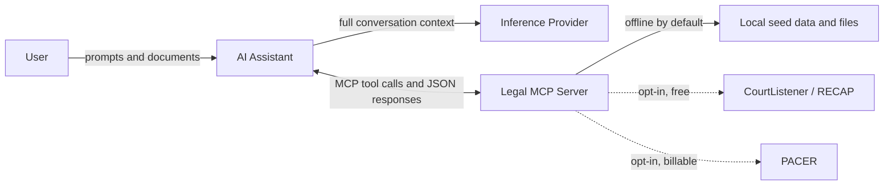

# Legal MCP Server — Research, Paralegal & Workflow Automation

A [Model Context Protocol](https://modelcontextprotocol.io) (MCP) server for
structured legal workflows. This **legal MCP server** provides tools, resources,
and prompts for precedent retrieval, statute analysis, citation validation,
contract clause comparison, and guided brief scaffolding — all backed by
inspectable, deterministic local data and optional (opt‑in) live legal databases.

> **This server provides legal‑workflow augmentation, not legal advice.** It
> does not replace attorney review and judgment.

- **Status:** V1 — implemented and tested.
- **Transport:** stdio, SSE, and streamable‑HTTP (via FastMCP).
- **Runtime:** Python 3.10+ and the official `mcp` SDK.

## Contents

- [Data flow & privacy boundaries](#data-flow--privacy-boundaries)
- [PACER and paid‑database fees (read first)](#-pacer-and-paid-database-fees-read-first)
- [Quick start](#-quick-start)
- [Capabilities](#-capabilities)
- [Live integrations (PACER & CourtListener/RECAP)](#-live-integrations-pacer--courtlistenerrecap)
- [Docker (optional)](#-docker-optional)
- [Use as an Agent Skill (Claude, Cursor, Codex, and more)](#-use-as-an-agent-skill-claude-cursor-codex-and-more)
- [Forking & building your own](#-forking--building-your-own-llm-friendly)
- [Architecture](#-architecture)
- [Testing, linting & types](#-testing-linting--types)
- [Legal & compliance notes](#-legal--compliance-notes)
- [AI agent privacy considerations](#-ai-agent-privacy-considerations)
- [Further reading](#-further-reading)
- [Integration & development support](#-integration--development-support)
- [License](#-license)

---

## Data flow & privacy boundaries

Understanding **where data goes** is essential before connecting this server to
an AI assistant or enabling live integrations. The diagram below shows the
three separate trust boundaries involved in a typical workflow.



| Boundary | What crosses it | Default behavior | Privacy note |
| --- | --- | --- | --- |
| **You → AI assistant** | Prompts, uploaded files, tool results pasted into chat | Always active when using an AI client | Your inference provider's ToS governs retention, training, and privilege — not this server |
| **AI assistant → MCP server** | Tool arguments (file paths, queries, contract IDs) and JSON responses | Local transport (stdio/SSE/HTTP on your machine) | Tool calls are audit-logged locally (`utils.audit`); responses stay on your network unless you expose the server |
| **MCP server → external databases** | Search queries to CourtListener or PACER | **Disabled by default** | Enable only when needed; PACER may incur fees (see below) |

**Key takeaway:** this MCP server is **offline and deterministic by default**.
The highest privacy risk in most setups is the **inference provider** (OpenAI,
Anthropic, Google, OpenRouter, etc.) receiving your full prompt context —
including excerpts returned by these tools. See
[AI agent privacy considerations](#-ai-agent-privacy-considerations) for
provider-specific guidance.

---

## ⚠️ PACER and paid‑database fees (read first)

**If you connect this MCP (or an AI assistant using it) to PACER or other paid
legal databases, you are responsible for all charges incurred on your
account.** PACER bills per page, per document, or per search. AI agents can
issue many requests in minutes; in real‑world testing a short (~10 minute)
agent session nearly exhausted a standard PACER account's **$30 per quarter**
fee waiver.

To protect you from surprise fees, **every live integration in this server is
disabled by default** and must be explicitly enabled with a feature flag and
credentials (see [Live integrations](#-live-integrations-pacer--courtlistenerrecap)).
Prefer the free **CourtListener / RECAP** source over PACER wherever possible.

For official PACER billing rules, see [pacer.gov](https://pacer.gov).

---

## 🚀 Quick start

```bash
# 1. Install dependencies (uses your user site-packages; a venv also works)
pip install -r requirements.txt

# 2. Run the server (SSE transport on http://127.0.0.1:8000/sse by default)
python main.py

# 3. (Optional) Explore it in the MCP Inspector
npx @modelcontextprotocol/inspector
#    In the Inspector: Transport = SSE, URL = http://127.0.0.1:8000/sse, Connect.
```

Run over a different transport:

```bash
python main.py --transport stdio            # for Claude Desktop / CLI clients
python main.py --transport streamable-http  # modern HTTP transport
python main.py --transport sse --port 9000  # custom port
```

All flags also read from environment variables: `MCP_TRANSPORT`, `HOST`,
`PORT`, `LOG_LEVEL`.

### Use it with the MCP CLI / Inspector directly

The server exposes a module‑level `mcp` object, so you can load it with the
MCP CLI:

```bash
mcp dev main.py:mcp     # launches the Inspector wired to this server
mcp run main.py:mcp     # runs the server via the CLI
```

---

## 🧰 Capabilities

### Tools (27)

| Category | Tool | Purpose |
| --- | --- | --- |
| Research | `search_precedents` | Keyword‑ranked precedent search over local cases |
| Research | `search_case_law` | Case‑law search with relevance ranking and summaries |
| Research | `extract_statute` | Statute text with optional legislative context |
| Research | `research_legal_issue` | Multi‑source research across local cases, statutes, and CourtListener |
| Citation | `validate_citation` | Validate structure and reporter; return issues |
| Citation | `normalize_citation` | Normalize spacing + Bluebook‑style abbreviations |
| Citation | `verify_citation_integrity` | Cross‑check a citation against the case database |
| Contract | `compare_contracts` | Clause‑level differ with risk flags |
| Contract | `analyze_clauses` | Rule‑based clause risk analysis |
| Contract | `extract_clauses` | Template‑filtered clause extraction |
| Contract | `suggest_clause_alternatives` | Curated alternative phrasings for risky clauses |
| Contract | `generate_negotiation_guide` | Per‑clause accept/negotiate/reject guide with fallback language, adjusted by party role |
| Document | `analyze_document` | Risk analysis for real `.docx` / `.txt` files |
| Document | `compare_documents` | Clause‑level diff for real `.docx` / `.txt` files |
| Document | `export_analysis_report` | Export a formatted `.docx` risk report |
| Document | `extract_contract_metadata` | Extract parties, dates, governing law, term, liability cap, and payment terms as structured JSON |
| Privilege | `check_privilege_risk` | Assess AI routing risk for potentially privileged documents; references *Heppner* and ABA Rule 1.6 |
| Brief | `generate_brief_outline` | Outline from a brief framework by case type |
| Brief | `create_argument_structure` | IRAC‑style argument scaffold |
| Brief | `generate_issue_statement` | Issue‑statement framework from facts + law |
| Analysis Queue | `queue_document_analysis` | Queue a document for local AI risk analysis; returns a job ID |
| Analysis Queue | `get_analysis_status` | Check status of a queued analysis job (queued/complete/error) |
| Analysis Queue | `get_analysis_result` | Retrieve the completed analysis result for a job |
| Analysis Queue | `list_analysis_jobs` | List all jobs with statuses and timestamps |
| Integrations | `integration_status` | Report which live sources are enabled/configured |
| Integrations | `search_live_case_law` | Query CourtListener/RECAP or PACER (when enabled) |

**13 contract templates** covering NDAs, MSAs (general + tech), DPAs (Global GDPR + US CCPA/CPRA), HIPAA BAA, Terms of Use, Privacy Policy, Advisor Agreement, California Offer Letter, Post‑Money SAFE, and Cookie Notice.

### Resources

Static:

- `legal://case-database` — precedent index
- `legal://statute-library` — statutory materials index
- `legal://contract-templates` — contract/template index
- `legal://brief-frameworks` — brief outline templates
- `legal://citation-standards` — reporter + Bluebook reference data
- `legal://integrations` — live‑integration status (feature flags/config)

Dynamic templates:

- `legal://case/{case_id}/analysis`
- `legal://statute/{statute_id}/context`
- `legal://contract/{contract_id}/differ`
- `legal://brief/{brief_id}/outline`

### Prompts (8)

`precedent_analysis`, `statutory_interpretation`, `brief_construction`,
`argument_development`, `contract_review`, `clause_comparison`,
`citation_validation`, `authority_integration`.

See [`WORKFLOW_EXAMPLES.md`](WORKFLOW_EXAMPLES.md) for end‑to‑end workflow
walkthroughs.

---

## 🔌 Live integrations (PACER & CourtListener/RECAP)

Live legal databases are **optional and disabled by default**. Each is
controlled by a **feature flag** plus **API credentials**, all supplied via
environment variables. Check the current state at any time:

```bash
# via the tool
search_live_case_law / integration_status
# or the resource
legal://integrations
```

`integration_status` and the `legal://integrations` resource return only
booleans and non‑sensitive metadata — **credentials are never echoed back**.

### CourtListener / RECAP (Free Law Project) — free, preferred

CourtListener exposes a free, rate‑limited [REST API
(v4)](https://www.courtlistener.com/help/api/rest/) that also serves the
[RECAP Archive](https://free.law/recap/) of PACER documents. Authentication is
an `Authorization: Token <token>` header.

| Variable | Default | Description |
| --- | --- | --- |
| `COURTLISTENER_ENABLED` | `false` | Feature flag to enable the integration |
| `COURTLISTENER_API_TOKEN` | _(unset)_ | Token from your CourtListener profile |
| `COURTLISTENER_BASE_URL` | `https://www.courtlistener.com/api/rest/v4` | Override for testing |

```bash
export COURTLISTENER_ENABLED=true
export COURTLISTENER_API_TOKEN="your-token-here"   # https://www.courtlistener.com/profile/api/
python main.py
```

### PACER (federal court records) — paid, off by default

PACER uses a two‑step flow described in the
[PACER Authentication API User Guide](https://pacer.uscourts.gov/help/pacer/pacer-authentication-api-user-guide):

1. **Authenticate** — `POST {auth}/services/cso-auth` with your `loginId` and
   `password` (and optional client code / TOTP passcode). Returns a
   `nextGenCSO` token.
2. **Search** — reuse the `nextGenCSO` token as a cookie against the PACER
   Case Locator (PCL) API.

Per PACER guidance the token is **reused** across requests (the client caches
it); it does not re‑authenticate on every call.

| Variable | Default | Description |
| --- | --- | --- |
| `PACER_ENABLED` | `false` | Feature flag to enable the integration |
| `PACER_ENVIRONMENT` | `qa` | `qa` (non‑billable test) or `production` (billable) |
| `PACER_LOGIN_ID` | _(unset)_ | PACER username |
| `PACER_PASSWORD` | _(unset)_ | PACER password |
| `PACER_CLIENT_CODE` | _(unset)_ | Optional client/billing code |
| `PACER_OTP_SECRET` | _(unset)_ | Optional base32 TOTP secret if 2FA is enabled |

```bash
export PACER_ENABLED=true
export PACER_ENVIRONMENT=qa          # start with the non-billable QA env
export PACER_LOGIN_ID="your-username"
export PACER_PASSWORD="your-password"
python main.py
```

> Register for a **non‑billable QA account** at
> [qa-pacer.uscourts.gov](https://qa-pacer.uscourts.gov) to test safely.
> Production accounts are billable. See the
> [developer resources](https://pacer.uscourts.gov/file-case/developer-resources).

Copy [`.env.example`](.env.example) to `.env` for a template of all settings.

---

## 🐳 Docker (optional)

```bash
# Build and run over SSE at http://localhost:8000/sse
docker compose up --build
```

Enable integrations by exporting variables (or using a `.env` file next to
`docker-compose.yml`) before `docker compose up`:

```bash
COURTLISTENER_ENABLED=true COURTLISTENER_API_TOKEN=... docker compose up --build
```

Or with plain Docker:

```bash
docker build -t legal-mcp .
docker run --rm -p 8000:8000 \
  -e COURTLISTENER_ENABLED=true -e COURTLISTENER_API_TOKEN=... \
  legal-mcp
```

---

## 🧩 Use as an Agent Skill (Claude, Cursor, Codex, and more)

MCP and [Agent Skills](https://agentskills.io) are complementary, not
competing: **MCP is the execution layer** (the 27 tools this server exposes),
while a **Skill is the methodology layer** — a portable `SKILL.md` file that
teaches an agent *which* tools to chain, *in what order*, and *what to
surface to the user* for a given task. Connecting the MCP server alone gives
an agent tools without a playbook; the skill is the playbook. Agent Skills
are an open, vendor‑neutral standard — the same `SKILL.md` works unchanged
across Claude Code, Cursor, Codex CLI, Gemini CLI, and other compliant
agents.

This repo ships one at
[`.agents/skills/legal-mcp-toolkit/SKILL.md`](.agents/skills/legal-mcp-toolkit/SKILL.md) —
the emerging cross‑agent convention for project‑level skills (recognized
natively by Cursor, Codex CLI, and Gemini CLI; Claude Code can load it via
its skills installer, or you can symlink/copy it into `.claude/skills/`). It
encodes eight workflow patterns (contract risk triage, negotiation prep,
metadata lookup, privilege-safe AI review, legal research, brief drafting,
citation cleanup, and batch analysis) as tool-call sequences, so an agent
with this server connected knows how to combine tools instead of guessing.

**To use it:**

- **Automatically**, if you clone or fork this repo — compliant agents
  discover project skills under `.agents/skills/` (or their own
  vendor‑specific path) for anyone working in the repository.
- **In another project**, copy the `legal-mcp-toolkit/` directory into that
  project's `.agents/skills/` (or your personal `~/.agents/skills/`)
  alongside connecting this MCP server, so the guidance travels with you.

See the [Agent Skills specification](https://agentskills.io/specification.md)
for the full open standard this skill follows.

---

## 🍴 Forking & building your own (LLM‑friendly)

This project is designed to be forked and extended, including by AI coding
assistants:

- **Predictable structure.** Tools live in `tools/`, resources in
  `resources/`, prompts in `prompts/`, integrations in `integrations/`, and
  all seed data in `data/`. Each module exposes a `register_*` function and is
  wired up centrally (`tools/__init__.py`, `resources/__init__.py`,
  `prompts/__init__.py`).
- **Deterministic + offline by default.** No hidden network calls; live
  sources are opt‑in.
- **[`AGENTS.md`](AGENTS.md)** documents how to run, test, and extend the
  server so an agent can navigate the repo quickly.

### Add a new tool

```python
# tools/my_tools.py
import json
from utils import audit, get_data_manager

def register_my_tools(mcp):
    data = get_data_manager()

    @mcp.tool()
    def my_tool(param: str) -> str:
        """Describe the legal intent clearly."""
        audit("my_tool", param=param)
        return json.dumps({"result": param}, indent=2)
```

Then call `register_my_tools(mcp)` from `tools/__init__.py`. Resources and
prompts follow the same pattern with `@mcp.resource(uri)` and `@mcp.prompt()`.

---

## 🏗️ Architecture

```
legal-mcp/
├── main.py                 # FastMCP server entry point (exposes `mcp`)
├── utils.py                # LegalDataManager + CitationParser + audit log
├── tools/                  # MCP tools (research, citation, contract, brief, integrations)
├── resources/              # MCP resources (case, statute, contract, brief, integrations)
├── prompts/                # MCP prompts (research, drafting, analysis, argument)
├── integrations/           # Optional live sources (config, courtlistener, pacer)
├── data/                   # Seed data (cases, statutes, contracts, templates, citations)
├── tests/                  # Unit + integration tests
├── Dockerfile              # Optional container image
├── docker-compose.yml      # Optional compose setup
└── requirements.txt        # Dependencies
```

The server initializes a `FastMCP` instance, registers all tools, resources,
and prompts, logs an audit trail, and runs the selected transport.

---

## 🧪 Testing, linting & types

```bash
pip install -r requirements.txt

pytest                 # run the full unit + integration suite
pytest --cov=. --cov-report=term-missing

python -m black .      # format
python -m flake8 .     # lint
python -m mypy .       # type-check
```

Integration tests exercise tools, resources, and prompts through the
in‑memory FastMCP API. The live integrations are tested with an
`httpx.MockTransport` so **no real network calls** are made.

> If the `pytest`, `black`, etc. scripts are not on your `PATH` after a
> `pip install --user`, invoke them via `python -m <tool>` as shown above.

---

## 🔐 Legal & compliance notes

- **Audit trails.** Every tool/resource call emits a structured audit log
  entry (`utils.audit`).
- **Deterministic core.** Local data operations are reproducible and make no
  hidden network calls.
- **Opt‑in external data.** PACER and CourtListener are disabled until you
  enable them; PACER may incur fees.
- **Not legal advice.** Output is a scaffold for attorney review.

## 🔒 AI agent privacy considerations

See [Data flow & privacy boundaries](#data-flow--privacy-boundaries) for a
visual overview of where data moves in a typical setup.

When an AI assistant (Claude, GPT-4, Gemini, etc.) calls this MCP server,
the **MCP server itself makes no external calls by default** — tool responses
stay between the server and the client. However, the **AI agent's own
inference provider** receives your full prompt context, which may include
excerpts from the documents and queries you pass to these tools.

Legal documents — especially privileged communications, client information,
and work product — carry confidentiality obligations under ABA Model Rule 1.6
and equivalent state rules. In *United States v. Heppner* (S.D.N.Y. Feb.
2026), a court held that consumer AI outputs were **not privileged** because
the user had no reasonable expectation of confidentiality under the
provider's standard terms.

### Recommended posture by data sensitivity

| Data class | Recommended AI inference approach |
| --- | --- |
| Attorney-client privileged / work product | Self-hosted model (Ollama, vLLM) or Azure OpenAI / Vertex AI with Zero Data Retention + BAA/DPA + regional pinning. Never consumer free-tier APIs. |
| Confidential but not privileged | Enterprise cloud API with no-training contract and modified abuse monitoring |
| Public record / non-sensitive research | Standard managed cloud APIs acceptable with standard review |

### Provider notes

**Self-hosted (strongest control)**
Run an open-weight model (Llama, Mistral, Gemma) locally with
[Ollama](https://ollama.com) or [vLLM](https://github.com/vllm-project/vllm).
No data leaves your machine. Ollama binds to loopback by default. Suitable
for pro se litigants and firms on a budget who need strong confidentiality
without enterprise cloud contracts.

**Azure OpenAI (Microsoft Foundry)**
Prompts are not shared with OpenAI or used for training by default. Regional
and DataZone deployments pin processing geography. For Zero Data Retention,
apply for Modified Abuse Monitoring via the
[Limited Access program](https://learn.microsoft.com/en-us/azure/ai-foundry/responsible-ai/openai/limited-access).
HIPAA BAA available. [Privacy docs](https://learn.microsoft.com/en-us/azure/ai-foundry/responsible-ai/openai/data-privacy).

**Google Vertex AI / Model Garden**
No-training default under Google's Service Specific Terms. Regional residency
configurable; use Assured Workloads for US-only boundaries. Avoid Google
Search grounding (forces 30-day retention). HIPAA BAA available.
[Data governance docs](https://cloud.google.com/vertex-ai/generative-ai/docs/data-governance).
You can also deploy open-weight models from Model Garden inside your own GCP
project so inference runs entirely within your VPC.

**OpenRouter**
A routing layer — prompts are always forwarded to an upstream inference
provider. Use [ZDR routing](https://openrouter.ai/docs/guides/features/zdr)
(`"provider": {"zdr": true}`), `data_collection: "deny"`, and Enterprise EU
routing if you need in-region processing. Still adds a routing hop compared
to direct enterprise tenancy; treat as higher risk for privileged content
without enterprise contractual controls in place.

### Key practices for agents on legal documents

- **Minimize payload** — redact names, SSNs, account numbers before cloud
  inference where possible
- **Audit who queries what** — the MCP server's audit log (`utils.audit`)
  records every tool call; pair this with your inference provider's logging
- **Counsel-directed workflows** — document that AI-assisted research was
  directed by an attorney (relevant to privilege analysis post-*Heppner*)
- **Read the vendor ToS** before routing client matter data — ABA Opinion 512
  requires it
- **Separate environments** — never use dev/sandbox API keys (which may lack
  ZDR) on production matter data

> This server is a research and analysis scaffold. It does not provide legal
> advice and does not substitute for attorney review. For questions about
> ethical AI use in legal practice, consult your jurisdiction's bar ethics
> guidance and [ABA Formal Opinion 512 (PDF)](https://www.americanbar.org/content/dam/aba/administrative/professional_responsibility/ethics-opinions/aba-formal-opinion-512.pdf) (2024).

## 📖 Further reading

- [Model Context Protocol](https://modelcontextprotocol.io)
- [ABA Formal Opinion 512 — Generative AI (PDF)](https://www.americanbar.org/content/dam/aba/administrative/professional_responsibility/ethics-opinions/aba-formal-opinion-512.pdf) (2024)
- [CourtListener API](https://www.courtlistener.com/help/api/rest/) ·
  [RECAP](https://free.law/recap/)
- [PACER developer resources](https://pacer.uscourts.gov/file-case/developer-resources)

## 💬 Integration & development support

Need help integrating this legal MCP server into your practice workflows,
enabling the PACER or CourtListener/RECAP adapters, or building custom law MCP
tools and extensions? Professional integration and development support is
available.

- **Email:** [edwin@genego.io](mailto:edwin@genego.io)
- **LinkedIn:** [Edwin Genego](https://www.linkedin.com/in/edwin-genego/)

We're happy to help with deployment, custom integrations, and tailored legal
workflow automation.

## 📝 License

[GNU Affero General Public License v3.0 (AGPL-3.0)](LICENSE).

Free to use, fork, and self-host. If you run a modified version as a network
service, AGPL-3.0 requires you to publish your changes. Organizations that
need to keep modifications private can contact
[edwin@genego.io](mailto:edwin@genego.io) for a commercial license.
